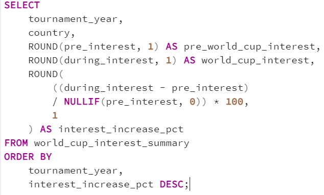
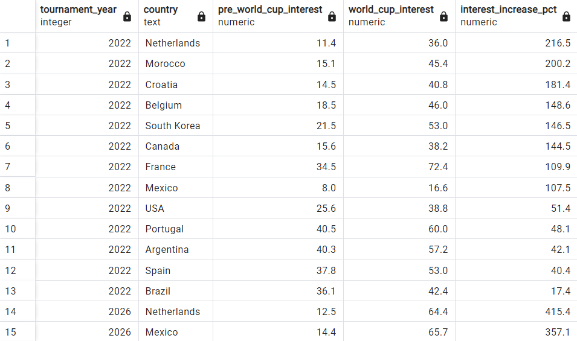
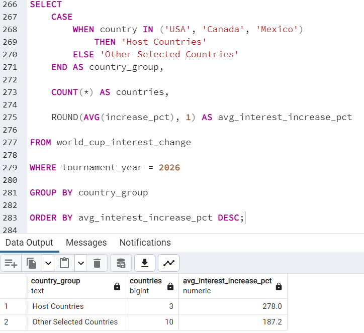
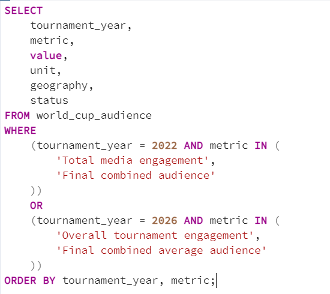
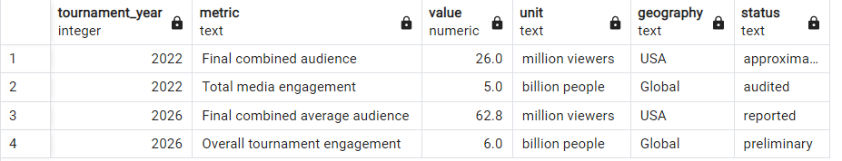

# The World Cup Effect

This project analyzes the **2022 and 2026 FIFA World Cups** using SQL, match data, Google Trends, and official audience figures.

The goal was to look beyond match results and understand how football interest changed once the World Cup began, whether the 2026 host countries experienced a stronger increase in interest, and whether better tournament performance was associated with higher engagement.

### Why I Chose This Project

I wanted to build a SQL project around something I actually follow and enjoy, so I decided to use the FIFA World Cup.

Instead of only looking at scores and winners, I wanted to explore what happens to football interest when the tournament starts.

I was also curious about a few things:

- Was the increase in interest bigger in 2026 than in 2022?
- Did the 2026 host countries see a stronger increase?
- Did teams that performed better also generate more interest?
- How large was the actual World Cup audience?

That led me to combine match data, Google Trends, and FIFA audience figures and look at the World Cup from both a performance and engagement perspective.

### Dataset Overview

For this project, I used World Cup match data for **2022 and 2026**, weekly Google Trends data, and published FIFA audience figures.

The match data contains **168 matches in total**:

- 64 matches from 2022
- 104 matches from 2026
- 480 goal records

For the football-interest analysis, I used weekly Google Trends data for the **Soccer** topic across 13 countries that participated in both tournaments:

**Argentina, Belgium, Brazil, Canada, Croatia, France, Mexico, Morocco, Netherlands, Portugal, South Korea, Spain, and USA.**

The combined Google Trends dataset contains **3,237 weekly observations**.

For each country, the Trends data was downloaded as one continuous series covering both tournament periods. This allowed me to compare changes within the same country over time.

Because Google Trends values are normalized from **0 to 100**, I did not treat the scores as raw search volumes or directly compare one country's score with another country's score.

I focused on the percentage change within each country instead.

### Tools Used

- **PostgreSQL** — data cleaning, transformation, joins, views, calculations, and analysis
- **pgAdmin** — database management, importing data, and running SQL queries
- **Python** — used only during the initial data preparation to normalize the World Cup JSON files and prepare staging CSV files

### Data Sources

- OpenFootball — World Cup match and goal data
- Google Trends — weekly football search-interest data
- FIFA — World Cup audience and viewership figures

> **Note:** Some of the SQL queries used CTEs or preparation steps that were longer than what could fit clearly in a screenshot. To keep the project easy to read, the screenshots show the most relevant part of the query and the result instead of every line of SQL.

## SQL Analysis

### 1. Which teams performed best in the 2022 and 2026 World Cups?

I started with the match data to get a basic view of team performance.

The original match table had separate columns for `team1` and `team2`, so I converted the matches into team-level records and calculated matches played, wins, draws, losses, shootout wins, and goal difference.

One issue I noticed was how penalty shootouts should be handled.

A team can advance by winning a penalty shootout, but the match itself is officially recorded as a draw. Because of that, I kept penalty-shootout wins separate instead of counting them as normal wins.

### Key Finding

Separating shootout wins gave a more accurate view of team performance.

For example, Argentina won the 2022 World Cup after advancing through penalty shootouts against the Netherlands and France. Those matches are treated as draws in the match record, while the shootout victories are tracked separately.

This made the team-level results easier to interpret without mixing normal match wins with shootout outcomes.

### 2. How much did football interest increase when the World Cup began?

After looking at team performance, I wanted to see how much football interest changed once the tournament started.

For each country, I compared its average Google Trends interest during the **8 weeks before the World Cup** with its average interest during the tournament.

This gave me a simple way to measure the increase from the level of attention going into the event.

### Key Finding

Football interest increased across all 13 countries in the sample during both tournaments.

In 2022, the average country-level increase was approximately **111.9%**.

The largest increases were:

- **Netherlands: +216.5%**
- **Morocco: +200.2%**
- **Croatia: +181.4%**

The average increase was even larger in 2026 at approximately **208.2%**.

Some of the largest increases in 2026 were:

- **Netherlands: +415.4%**
- **Mexico: +357.1%**
- **Belgium: +307.8%**
- **Croatia: +282.8%**
- **Canada: +262.4%**

A large percentage increase does not necessarily mean a country had the highest total search volume. It means football interest increased strongly compared with that country's own pre-tournament level.

### 3. Did the 2026 host countries experience a larger increase in football interest?

One thing that stood out in the 2026 results was that **USA, Canada, and Mexico were also the three host countries**.

Since hosting the tournament could create additional media attention and local interest, I wanted to compare the three hosts with the other 10 countries in the sample.

I grouped the countries into:

- **Host Countries:** USA, Canada, Mexico
- **Other Selected Countries:** the remaining 10 countries

I then compared their average increase in football interest during the 2026 World Cup.

### Key Finding

The three host countries had an average football-interest increase of approximately **278.0%** during the 2026 tournament.

The other 10 selected countries averaged approximately **187.2%**.

This suggests that the host countries experienced a stronger increase in football interest within this sample.

However, this does not prove that hosting caused the difference. The host group contains only three countries, and other factors such as team performance, media coverage, existing football popularity, and tournament storylines could also affect search interest.

### 4. Did teams that performed better also see a bigger increase in football interest?

After comparing the two tournaments, I wanted to see whether changes in team performance were reflected in changes in football interest.

I created a simple ranking based on the deepest stage each team reached:

**1 = Group Stage, 2 = Round of 32, 3 = Round of 16, 4 = Quarterfinal, 5 = Semifinal, 6 = Third Place, 7 = Final**

I then compared each team's tournament-stage change with the change in its Google Trends interest spike between 2022 and 2026.

### Key Finding

For some countries, better performance and stronger football interest moved in the same direction.

For example:

- **Spain:** stage change +4, interest-spike change +58.5 percentage points
- **Belgium:** stage change +3, interest-spike change +159.2 percentage points
- **Mexico:** stage change +2, interest-spike change +249.6 percentage points
- **Canada:** stage change +2, interest-spike change +117.9 percentage points

But the relationship was not consistent across every country.

The Netherlands reached an earlier stage in 2026 but still had an interest spike that was **198.9 percentage points higher** than in 2022.

Croatia also reached an earlier stage while still experiencing a considerably larger interest spike.

This suggests that tournament performance may contribute to football interest, but it does not explain the full change by itself.

The stage ranking is only a rough comparison because the 2026 tournament included an additional Round of 32, so the tournament structures were not identical.

### 5. What do official audience figures tell us about the scale of the World Cup?

Google Trends measures search interest, but it does not tell us how many people actually watched or engaged with the tournament.

For the final part of the project, I added published FIFA audience figures to give some context around the overall scale of the World Cup.

I kept these figures separate from the Google Trends calculations because they measure different things.

### Key Finding

FIFA reported approximately **5 billion people engaged with the 2022 World Cup across media**.

For the 2026 tournament, FIFA reported that **nearly 6 billion people had engaged with the competition**, although the consolidated broadcast reporting was still being completed.

The U.S. audience for the final also stood out.

The 2022 World Cup final had a combined U.S. audience of **almost 26 million**, while the 2026 final had a reported **62.8 million combined average audience across FOX and Telemundo**.

I did not calculate a direct percentage increase between these audience figures because the published metrics are not all defined in exactly the same way.

Instead, I used them as supporting context for the scale of the two tournaments.

## Key Takeaways

Using SQL to connect tournament performance, Google Trends, and audience data led to a few findings that stood out:

- **Football interest increased sharply once the World Cup began** across all 13 countries in the sample.
- The average increase from the pre-tournament baseline was approximately **111.9% in 2022 and 208.2% in 2026**.
- **The three 2026 host countries showed a larger average increase in football interest** than the other 10 selected countries.
- **Better tournament performance did not always mean a larger increase in interest.** Some teams generated much stronger search interest despite reaching an earlier stage.
- **Google Trends and audience figures measure different things**, so I kept search interest and actual audience data separate.
- The official FIFA figures show the scale of the event, with billions of people engaging with both tournaments.
- From a SQL perspective, the project gave me experience working with **CTEs, joins, conditional aggregation, views, date-based analysis, percentage calculations, `FILTER`, `COALESCE`, and data-quality checks**.

## Final Thoughts

I liked this project because it started with a sport I already follow, but the analysis ended up going beyond match results.

The biggest thing I noticed was that football interest around a World Cup depends on more than just how far a team progresses.

Hosting the tournament, existing football interest, media attention, and other factors can all play a role.

I also learned that metrics that sound similar can measure very different things. Google Trends, media engagement, and television audiences all tell us something about World Cup interest, but they should not be treated as the same measure.

There were also a few practical data issues along the way. The original match data was nested JSON, goal minutes included stoppage time such as `90+7`, tournament formats were different, and my first goal ID was not actually unique.

Working through those issues made this feel much closer to a real analysis than a normal SQL practice exercise.

Thanks for reading!
