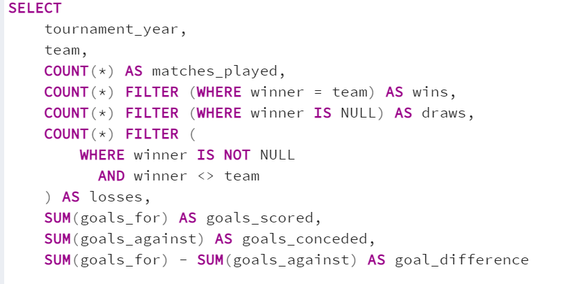
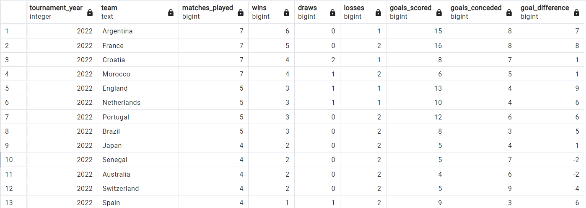
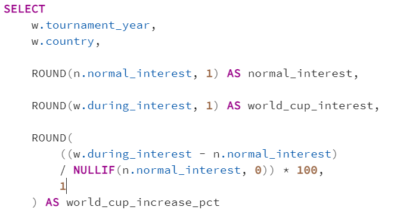
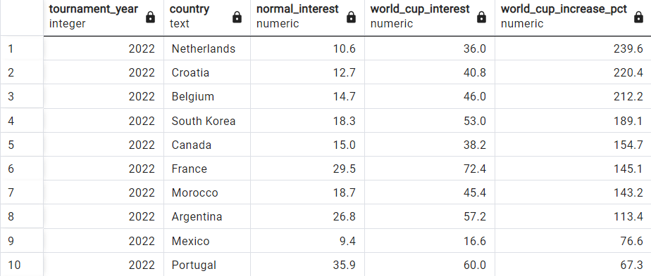
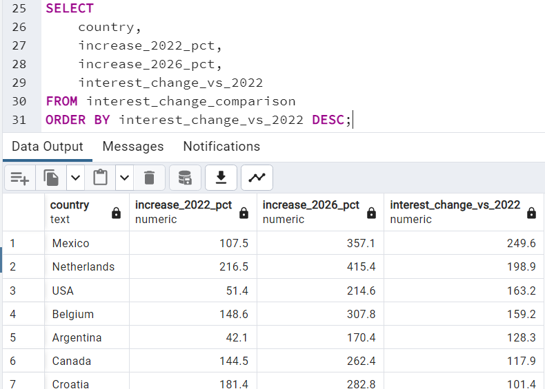
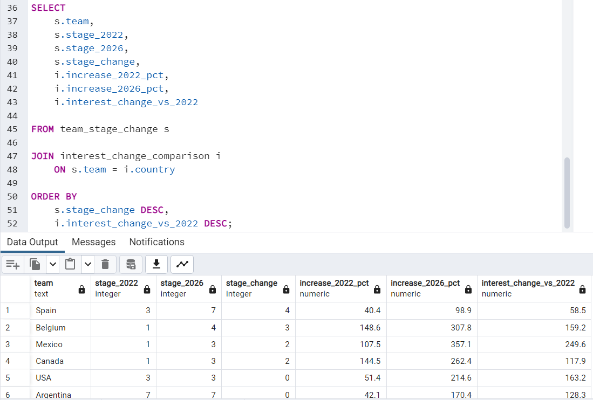
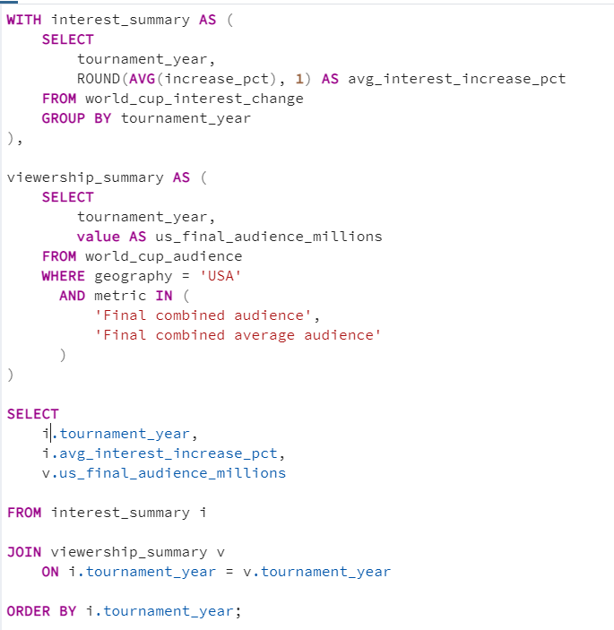
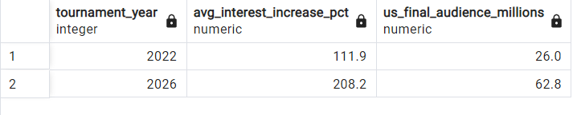

# The World Cup Effect

This project analyzes the **2022 and 2026 FIFA World Cups** using SQL, match data, Google Trends, and audience figures.

The goal was to look beyond match results and understand how football interest changes during a World Cup, how 2026 compared with 2022, and whether stronger tournament performance was linked with higher engagement.

### Why I Chose This Project

I wanted to build a SQL project around something I actually follow and enjoy, so I decided to use the FIFA World Cup.

Instead of only looking at scores and winners, I wanted to understand what happens to football interest during the tournament. I was also curious to see whether the 2026 World Cup created more engagement than 2022, and whether teams that performed better also saw a bigger increase in interest.

That led me to combine match data with Google Trends and audience figures and look at the World Cup from both a performance and engagement perspective.

### Dataset Overview

For this project, I used World Cup match data for **2022 and 2026**, along with weekly Google Trends data and published FIFA audience figures.

The match data contains **168 matches in total**:

- 64 matches from 2022
- 104 matches from 2026
- 480 goal records

For the football-interest analysis, I used weekly Google Trends data for the **Soccer** topic across 13 countries that participated in both tournaments:

**Argentina, Belgium, Brazil, Canada, Croatia, France, Mexico, Morocco, Netherlands, Portugal, South Korea, Spain, and USA.**

The combined Google Trends dataset contains **3,237 weekly observations**.

I also used FIFA audience figures to add actual viewership context alongside the search-interest analysis.

### Tools Used

- **PostgreSQL** — data cleaning, transformation, joins, views, calculations, and analysis
- **pgAdmin** — database management, importing data, and running SQL queries
- **Python** — used only during the initial data preparation to normalize the World Cup JSON files and prepare staging CSV files

### Data Sources

- OpenFootball — World Cup match and goal data
- Google Trends — weekly football search-interest data
- FIFA — World Cup audience and viewership figures

> **Note:** Some of the SQL queries used CTEs or preparation steps that were longer than what could fit clearly in a screenshot. To keep the project easy to read, the screenshots show the most relevant part of the query and the result instead of every line of SQL.

> For the normal-period comparison in Question 2, I compared World Cup weeks with the same weeks of the year in non-World-Cup years. For Questions 3 and 4, I used the weeks immediately before each World Cup as the baseline because I wanted to compare the increase from the level of interest going into each tournament.

## SQL Analysis

### 1. Which teams performed best in the 2022 and 2026 World Cups?

I started with the match data to get a basic view of how each team performed.

The original match table had separate columns for `team1` and `team2`, so I first converted the matches into team-level records. From there, I calculated matches played, wins, draws, losses, goals scored, goals conceded, and goal difference.

For knockout matches, I used the extra-time score when it was available so penalty-shootout kicks were not counted as normal match goals.

### Key Finding

Argentina led the 2022 results with **6 wins in 7 matches**, followed by France with 5 wins.

In 2026, Spain recorded **7 wins and 1 draw in 8 matches**, while Argentina also recorded 7 wins.

This gave me the performance side of the analysis before bringing football interest into the project.

### 2. How much higher was football interest during the World Cup than during normal periods?

After looking at team performance, I wanted to measure the actual **World Cup effect** on football interest.

Instead of only comparing the tournament with the few weeks immediately before it, I compared World Cup weeks with the **same time of year in non-World-Cup years**.

This helped make the comparison more meaningful because the 2022 and 2026 World Cups were held at different times of the year.

### Key Finding

Football interest was much higher during the World Cup than during normal periods across the 13-country sample.

In 2022, the average country-level increase was approximately **128.5%**.

The largest increases were:

- **Netherlands: +239.6%**
- **Croatia: +220.4%**
- **Belgium: +212.2%**

The difference was even larger in 2026, when the average country-level increase was approximately **256.8%**.

Some of the biggest increases in 2026 were:

- **Mexico: +636.0%**
- **Netherlands: +364.9%**
- **Croatia: +334.7%**

One thing I kept in mind was that Google Trends is a relative measure. A large percentage increase does not necessarily mean that country had the highest total number of football searches. It means interest increased strongly compared with that country's normal level.

### 3. Was the 2026 interest spike larger than 2022?

After seeing how much interest increased during the World Cup, I wanted to compare the two tournaments directly.

For this part, I compared each country's tournament-period interest with its average interest in the weeks immediately before that World Cup. I then compared the 2022 and 2026 percentage increases.

### Key Finding

Mexico showed the largest increase in its World Cup spike between the two tournaments.

Its interest increase went from **107.5% in 2022 to 357.1% in 2026**, a difference of **249.6 percentage points**.

Other large changes included:

- **Netherlands: +198.9 percentage points**
- **USA: +163.2 percentage points**
- **Belgium: +159.2 percentage points**
- **Argentina: +128.3 percentage points**

Across the 13 selected countries, the average increase from the immediate pre-tournament baseline was approximately **111.9% in 2022** and **208.2% in 2026**.

Within this sample, the 2026 tournament produced a much larger search-interest spike than 2022.

### 4. Did better tournament performance lead to higher engagement?

This was one of the questions I was most interested in.

I created a simple stage ranking to compare how far each team progressed in 2022 and 2026:

**1 = Group Stage, 2 = Round of 32, 3 = Round of 16, 4 = Quarterfinal, 5 = Semifinal, 6 = Third Place, 7 = Final**

I then joined the change in tournament performance with the change in Google Trends interest.

### Key Finding

There were several examples where better tournament performance and stronger engagement moved in the same direction.

For example:

- **Spain:** stage change +4, engagement-spike change +58.5 percentage points
- **Belgium:** stage change +3, engagement-spike change +159.2 percentage points
- **Mexico:** stage change +2, engagement-spike change +249.6 percentage points
- **Canada:** stage change +2, engagement-spike change +117.9 percentage points

However, the relationship was not consistent.

The Netherlands reached an earlier stage in 2026 but still saw its engagement spike increase by **198.9 percentage points**.

Croatia also reached an earlier stage but still experienced a considerably larger interest spike than in 2022.

This showed me that tournament performance can be part of the reason interest changes, but it does not explain the whole story.

The stage ranking is only a rough measure of tournament progression, especially because the 2026 format included an additional Round of 32.

### 5. How did actual World Cup viewership compare with online interest?

Google Trends measures online search interest, but it does not tell us how many people actually watched the tournament.

I wanted to keep those two things separate, so I added published FIFA audience figures as the final part of the analysis.

For a simple comparison, I placed the average Google Trends increase across the 13-country sample next to the U.S. audience for the World Cup final.

### Key Finding

The average Google Trends increase from the immediate pre-tournament baseline rose from approximately **111.9% in 2022 to 208.2% in 2026**.

At the same time, the U.S. audience for the World Cup final increased from **almost 26 million in 2022** to a **62.8 million combined average audience across FOX and Telemundo in 2026**.

I stored the 2022 figure as 26.0 million in the SQL table for comparison, but the published figure is described as **almost 26 million**, so I treated it as approximate.

I would not say that higher online search interest caused higher viewership. They are different measures and cover different populations.

What the comparison shows is that both search interest in the selected countries and U.S. final viewership were considerably higher around the 2026 tournament.

## Key Takeaways

Using SQL to connect match performance, Google Trends, and audience data led to a few findings that stood out:

- **Football interest was much higher during World Cup periods than during comparable normal periods.**
- The average normal-period-to-World-Cup increase across the 13-country sample was approximately **128.5% in 2022 and 256.8% in 2026**.
- **Mexico showed the largest increase in its tournament spike compared with 2022**, followed by the Netherlands, USA, and Belgium.
- **Better tournament performance did not always lead to a larger engagement increase.** Some teams generated considerably more interest even after reaching an earlier stage.
- **Search interest and viewership are different measures**, so I kept them separate instead of treating Google Trends as audience data.
- **U.S. World Cup final viewership was substantially higher in 2026**, increasing from almost 26 million in 2022 to 62.8 million in 2026.
- From a SQL perspective, this project gave me experience working with **CTEs, joins, conditional aggregation, views, date-based analysis, percentage calculations, `FILTER`, `COALESCE`, and window functions**.

## Final Thoughts

I liked this project because it started with a sport I already follow, but the analysis ended up going beyond match results.

The part that stood out most to me was seeing how much football interest changed during the World Cup compared with normal periods. I also found it interesting that better tournament performance did not always lead to a larger increase in engagement.

The project also reminded me that metrics that sound similar can measure very different things. Google Trends, online engagement, and television viewership all tell us something about World Cup interest, but they should not be treated as the same measure.

There were also a few practical data issues along the way. The original match data was nested JSON, goal minutes included stoppage time such as `90+7`, the two tournaments had different formats, and my first goal ID was not actually unique.

Working through those issues made this feel much closer to a real analysis than a normal SQL practice exercise.

Thanks for reading!

 

    

 

    

